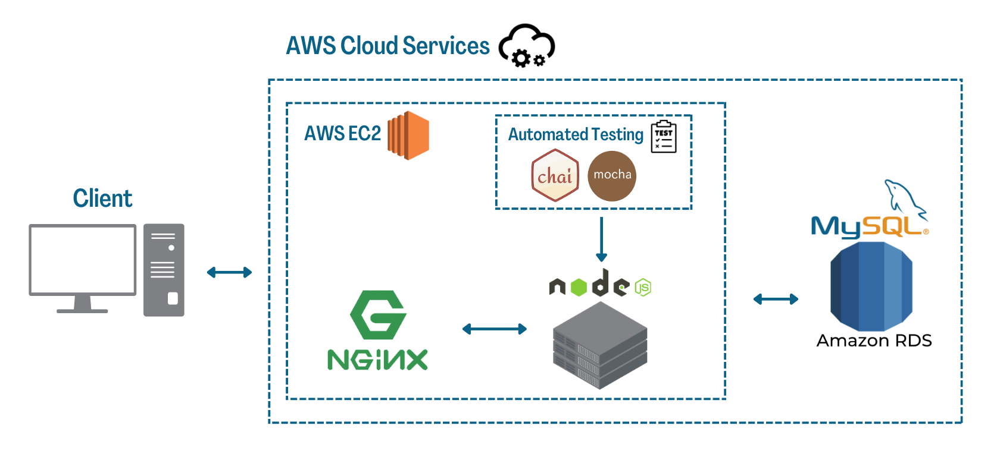
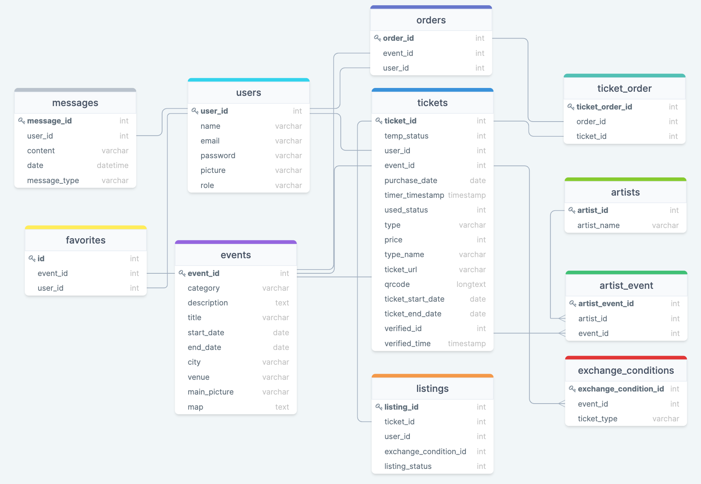
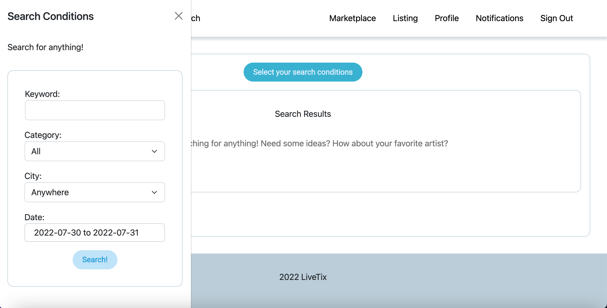
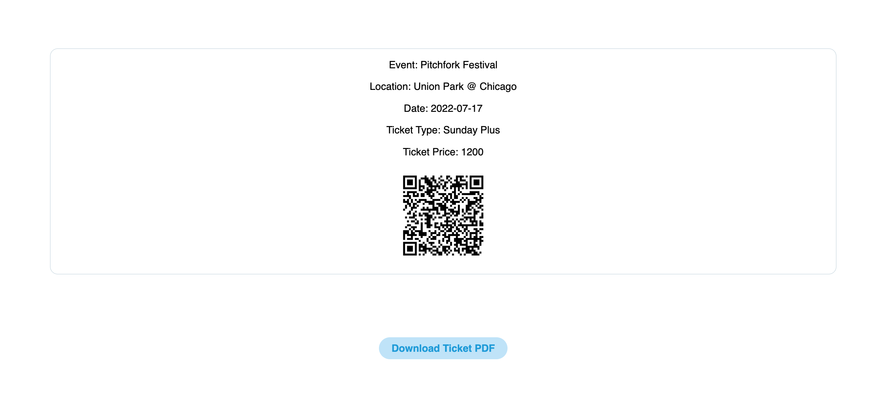
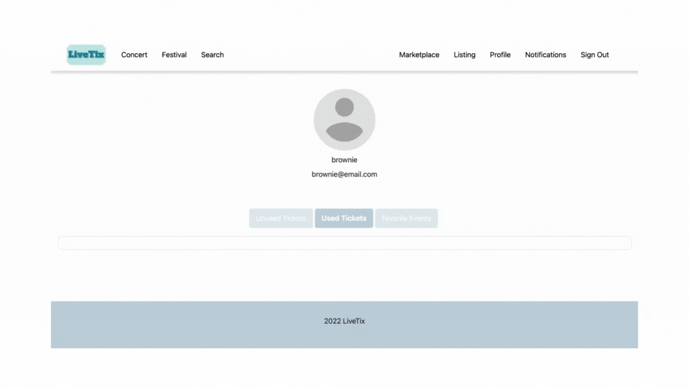
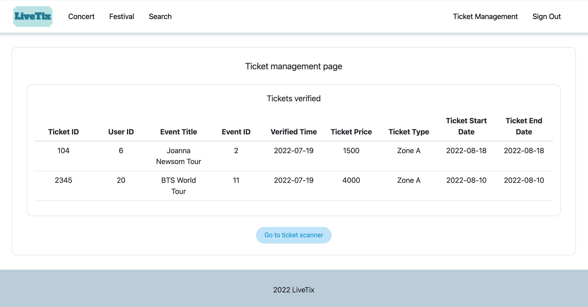
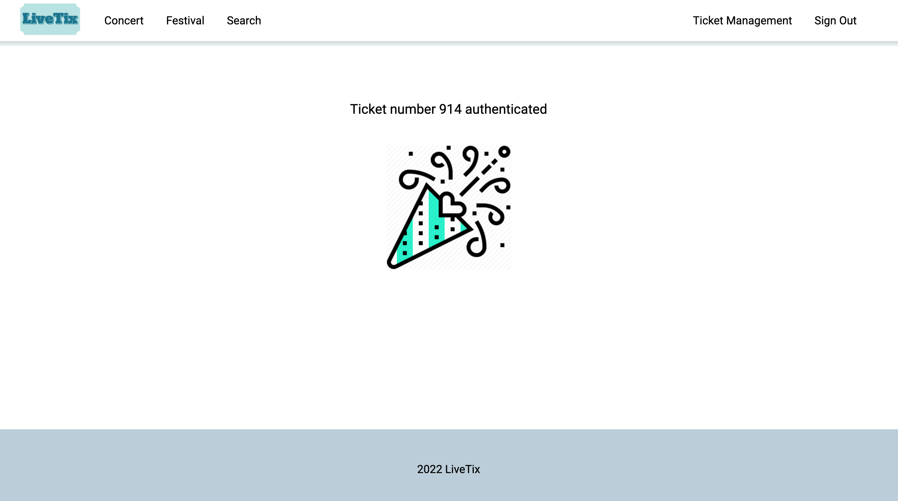
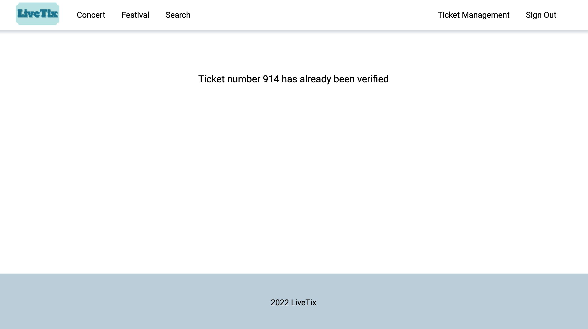

# LiveTix
A ticketing website that sells event tickets and connects users with a ticket-exchange marketplace.\
Enter LiveTix here: [Click Me!](https://livetix.site)

[comment]: <> (A ticketing website that offers a B2C ticket selling/purchasing service and a C2C ticket-exchange marketplace.)

## Table of content
- [Site Demo](#site-demo)
- [Technologies](#technologies)
- [System Design](#system-design)
- [Database Schema](#database-schema)
- [Features](#features)

## Site Demo Account
### User Account
- Email: demo@email.com
- Password: demo

### Admin Account
- Email: admin_demo@email.com
- Password: admin_demo
<!-- - Notes: when verifying tickets, please open the site on your computer to scan the ticket QRcodes.  -->

## Technologies
### Back-Eend
- Node.js
- Express.js
- Linux

### Front-End
- HTML
- CSS
- JavaScript
- Bootstrap

### Database
- MySQL

### Cloud Services
- AWS EC2
- AWS RDS

### Third Party APIs/SDKs
- Google Map API
- TapPay SDK

### Automated Testing
- Mocha
- Chai

### Network Essentials
- HTTPS
- SSL
- DNS
- Nginx

## System Design

## Database Schema

## Features
### **Client-side Features**
### Event Browsing and Searching
- Events categories include 'concert' and 'festival', and are quickly accessed through filters in the header section.
- Alternatively, users can also click on 'search' in the header to go to the search page, and conduct detailed searches, filtering events using combinations of keyword, category, city, and date conditions.

### Event Details, Favorite Events, and Ticket Purchase
- Each event page displays event-specific details, including an interactive map of the event venue, and allows users to favorite the event for easy tracking.
- Users can purchase tickets on each event page by first selecting and reserving tickets. Users are given 5 minutes to complete the purchase.
- Upon successful purchase, tickets are displayed on the user profile page.

### Ticket Details
- Clicking into each ticket in the ticket section of the user profile page, users can see detailed information of the ticket, including the ticket QRcode used for event entry, and a button to download the PDF file of the ticket.

### Ticket Listing
- LiveTix offers a ticket exchange marketplace in case users wish to exchange tickets with other users. Users can go to the Listing page to post tickets they own and select their exchange conditions.

### Marketplace Exchange and Notification
- Users can also browse through all current listings that other users have posted in the marketplace.
- By clicking on the listings, users can select the ticket they intend to exchange for. If users have tickets that match the selected listing's exchange conditions, users can then press 'submit' to execute the exchange, and the exchanged ticket is displayed on the user profile page, replacing the ticket that the users used for the exchange.

### **Business-side Features**
### Ticket Management Page
- When the event time comes, the event management team can use the LiveTix ticket management features to monitor and manage event tickets.
- On the ticket management page, a table of all verified tickets for the current admin user is displayed.
- To verify tickets, admin user can click on the ticket scanner button to scan the ticket QRcode.

### Ticket Verification
- After scanning the ticket, a message will appear on the verification page to indicate the status, either valid or invalid, of the ticket.

